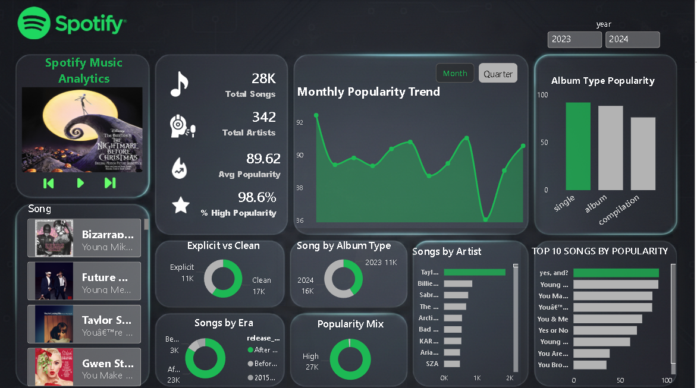

# 🎵 Spotify Music Analytics Dashboard 

## 📌 Overview 
This project presents an interactive **Power BI dashboard** built to analyze Spotify music data.  
The analysis focuses on **popularity trends, catalogue quality, and content performance**.

The objective is to transform raw music data into **actionable business insights** through structured data preparation, analytical modeling, and effective visualization. 
 
---

## 🎯 Project Objectives 
- Analyze overall music catalogue performance
- Identify popularity trends over time
- Compare performance across different album types
- Measure song quality using popularity-based metrics
- Deliver a clean, single-page dashboard suitable for executive and analytical review

---

## 🛠 Data Preparation & Cleaning
Data preparation was performed using **Microsoft Excel** prior to loading the data into Power BI.

### 🔑 Key steps included:
- Cleaning raw data by correcting formats and handling inconsistencies
- Creating derived columns such as year, month, duration (in minutes), and popularity categories
- Standardizing categorical fields including album type and explicit flag
- Structuring the dataset for efficient analysis and visualization

This process ensured the dataset was **analysis-ready** before visualization.

---

## 📊 Dashboard Features & Insights

### 🔑 Key Performance Indicators (KPIs)
- Total Songs  
- Total Artists  
- Average Popularity  
- Percentage of High Popularity Songs  

These KPIs provide a high-level snapshot of catalogue performance.

---

### 📈 Analytical Visuals
- **Monthly Popularity Trend**  
  Tracks changes in average popularity over time.

- **Album Type Popularity**  
  Compares popularity across singles, albums, and compilations.

- **Popularity Mix**  
  Segments songs into low, medium, and high popularity categories.

- **Explicit vs Clean Content**  
  Analyzes the distribution of explicit and clean tracks.

- **Release Era Distribution**  
  Groups songs by release periods to highlight era-based trends.

- **Chart Rank Split**  
  Compares Top 10 songs against the rest of the catalogue.

- **Top Songs by Popularity**  
  Highlights the best-performing tracks.

---

## 🎛 Interactivity
- Year slicer to dynamically filter all visuals
- Song selector for focused song-level analysis

Interactivity is intentionally limited to maintain **clarity, usability, and clean design**.

---

## ⚙️ Tools & Technologies

### Microsoft Excel
- Data cleaning
- Feature engineering (derived columns such as year, month, duration, popularity categories, and release eras)
- Table preparation for analysis

### Power BI Desktop
- Data modeling
- DAX calculations
- Interactive dashboard development

### DAX
- KPI calculations
- Percentage and ratio-based measures

---

## 🎨 Design Approach
- Single-page dashboard layout
- Dark theme inspired by Spotify branding
- Clear visual hierarchy (KPIs → Trends → Breakdown)
- Minimal slicers to avoid clutter
- Focus on business relevance over visual overload

---

## 📷 Dashboard Preview

